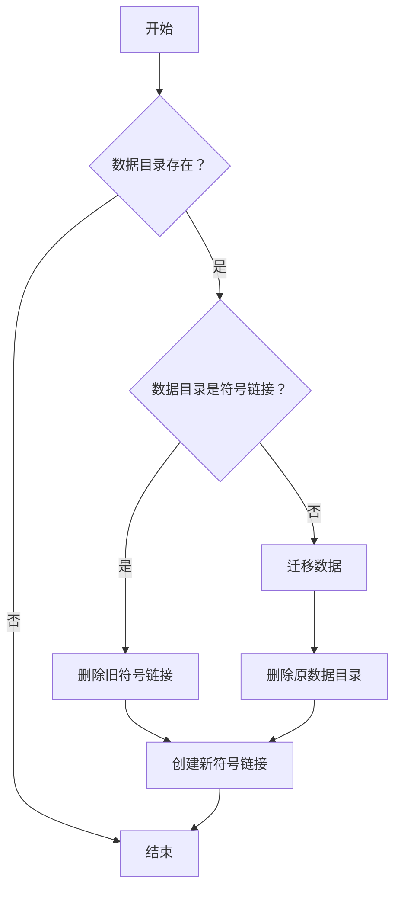

# 提交贡献

以下是几点提交贡献的小提示：

1. 不要重复添加以下仓库已有的配置清单，除非配置清单内容不同或有特殊优化：

    此仓库为潇然系统优化版 scoop（可通过上面的命令安装）打造，默认安装会添加以下仓库：

    | Name            | Source                                             |
    | --------------- | -------------------------------------------------- |
    | main            | <https://github.com/ScoopInstaller/Main>             |
    | extras          | <https://github.com/ScoopInstaller/Extras>           |
    | versions        | <https://github.com/ScoopInstaller/Versions>         |
    | nirsoft         | <https://github.com/ScoopInstaller/Nirsoft>          |
    | sysinternals    | <https://github.com/niheaven/scoop-sysinternals>     |
    | php             | <https://github.com/ScoopInstaller/PHP>              |
    | nerd-fonts      | <https://github.com/matthewjberger/scoop-nerd-fonts> |
    | nonportable     | <https://github.com/ScoopInstaller/Nonportable>      |
    | java            | <https://github.com/ScoopInstaller/Java>             |
    | games           | <https://github.com/Calinou/scoop-games>             |
    | **dorado**      | <https://github.com/chawyehsu/dorado.git>            |

2. 无需担心 GitHub 无法下载问题，优化版 Scoop 自带的 `Url Proxy` 功能能够自动处理

3. 尽量使用便携版软件，并 `persist` 程序数据，尽量纳入 scoop 原生管理

4. 不要使用绝对路径，请使用 scoop 提供的变量或 `$env:系统变量`

5. 安装时创建的文件，卸载的时候要删除

6. 如果有自动更新程序，最好干掉，如果是后台自动更新无法关闭那种，不要安装到 `scoop\apps` 目录下

7. 如果能加入优化配置文件，如禁止更新、关闭广告等，那么请尽量加入（别人不做的我们做）

8. 受限于 scoop 的机制，不适合用 scoop 安装的软件，可以 ~~祸害~~ 提交到其它仓库（甩锅+手动狗头.jpg）

9. 遵循 [Scoop Contributing Guide](https://github.com/ScoopInstaller/.github/blob/main/.github/CONTRIBUTING.md#for-scoop-buckets) 的规范提交 Pull Request，懒得看的话，需要注意以下几点：

    - 不要用 Master 分支提交 Pull Request
    - 一个 Manifest 一个 Branch 一个 Pull Request
    - 本仓库对 Pull Request、Commit 和 Branch 命名没有强制性要求，但要能看得出来改了什么

10. 提交 PR 前，请开一台电脑或虚拟机，要求**开启 UAC**，测试以下内容：

    - 能够正常安装

        ```powershell
        scoop install .\bucket\<name>.json
        ```

    - 能够正常使用

    - 能够正常持久化配置文件

    - 能够正常卸载

    - 能够正常执行 Autoupdate，两种测试方法：

        1. VS Code “运行和调试” 中测试（按 F5）

        2. 在项目根目录执行：

            ```powershell
                .\bin\checkver.ps1 -App 软件名称 -ForceUpdate
            ```

11. 提交 PR 时，清空默认的提交内容，加入你认为有用的信息（提交上一步测试的截图/输出）

12. 提交 PR 后，如果有更改，在 GitHub PR 页面发送评论 `/verify`，让机器人再次检测

希望此规范能够帮助到参与第三方 scoop 仓库的贡献者，提供一个轻松、高效的软件提交流程，如果不会搞的话可以发 issue。

## 编写技巧

本仓库一些关于编写配置的规范和技巧（不看会后悔）

### 配置定义

你想知道关于配置清单的定义项，这里都有，在编写配置清单时建议同时打开：

- [App Manifests](https://github.com/ScoopInstaller/Scoop/wiki/App-Manifests)
  - [Creating an App Manifest](https://github.com/ScoopInstaller/Scoop/wiki/Creating-an-app-manifest)
  - [Autoupdate](https://github.com/ScoopInstaller/Scoop/wiki/App-Manifest-Autoupdate)
  - [Persistent data](https://github.com/ScoopInstaller/Scoop/wiki/Persistent-data)
  - [Pre and Post install and uninstall Scripts](<https://github.com/ScoopInstaller/Scoop/wiki/Pre-Post-(un)install-scripts>)

### 读取脚本

读取现有配置中的脚本块，避免人脑反转义

从配置清单中读取：

```powershell
PS D:\sdoog> (Get-Content .\bucket\qqnt.json | ConvertFrom-Json).installer.script

# Output:
$configpath = "$([Environment]::GetFolderPath('CommonDocuments'))\Tencent\QQ"
if (!(Test-Path -Path "$configpath")) {
    New-Item -Path "$configpath" -Type Directory -Force -ErrorAction SilentlyContinue | Out-Null
}
if (!(Test-Path -Path "$configpath\UserDataInfo.ini" -PathType leaf)) {
    Set-Content -NoNewline -Path "$configpath\UserDataInfo.ini" -Value "[UserDataSet]`nUserDataSavePathType=2`nUserDataSavePath=`"$persist_dir\Tencent Files`""
}
```

从 `scoop cat` 中读取：

```powershell
PS D:\sdoog> (scoop cat python | ConvertFrom-Json).installer.script

# Output:
Expand-DarkArchive "$dir\setup.exe" "$dir\_tmp"
@('path.msi', 'pip.msi') | ForEach-Object {
    Remove-Item "$dir\_tmp\AttachedContainer\$_"
}
(Get-ChildItem "$dir\_tmp\AttachedContainer\*.msi").FullName | ForEach-Object {
    # appendpath.msi does not contain any file, which causes 'msiexec /a' to fail
    if($((Get-Item $_).Basename) -eq 'appendpath') { return }
    Expand-MsiArchive $_ "$dir"
}
Remove-Item "$dir\_tmp", "$dir\setup.exe" -Force -Recurse
if ($global) {
    $pathext = (Get-EnvVar -Name PATHEXT -Global) -replace ';.PYW?', ''
    Set-EnvVar -Name PATHEXT -Value "$pathext;.PY;.PYW" -Global
}
```

### 嵌入脚本

还在吐槽爬虫难写、人工转义费劲？

将 PowerShell 脚本块转换成 JSON Array 以便嵌入到配置中，自动转义相关符号，避免人工转义

所以你可以放心往脚本里面多写点东西，使此仓库具有独特性

```powershell
PS D:\sdoog> Get-Content .\Untitled-1.ps1

# Output:
if ($global) {
    $pathext = (Get-EnvVar -Name PATHEXT -Global) -replace ';.PYW?', ''
    Set-EnvVar -Name PATHEXT -Value "$pathext;.PY;.PYW" -Global
}

PS D:\sdoog> Get-Content .\Untitled-1.ps1 | ConvertTo-Json

# Output:
[
  "if ($global) {",
  "    $pathext = (Get-EnvVar -Name PATHEXT -Global) -replace ';.PYW?', ''",
  "    Set-EnvVar -Name PATHEXT -Value \"$pathext;.PY;.PYW\" -Global",
  "}"
]
```

### 蓝奏文件夹分享自动更新

参考 [pecmd-beta](bucket/pecmd-beta.json)

### WinGet 自动更新

我们提供了 WinGet PowerShell 模块，只需导入即可使用

manifestUrl 会在 DEBUG 中输出，建议开启 DUBUG，以便查看具体 YAML 配置

如果只要版本号，可以：

```json
"checkver": {
    "script": [
        "Import-Module \"$pwd\\bin\\WinGet.psm1\"",
        "$Manifest = Get-WinGetInfo -Id '<WinGetPackageID>'",
        "$Manifest.latest_version"
    ]
},
"autoupdate": {
    "url": "https://www.example.com/download/$version/$version"
}
```

如果要同时将版本号和 URL 同时匹配出来，可以：

```json
"checkver": {
    "script": [
        "Import-Module \"$pwd\\bin\\WinGet.psm1\"",
        "$Manifest = Get-WinGetManifest -Id '<WinGetPackageID>'",
        "$version  = $Manifest.PackageVersion",
        "$url      = $Manifest.Installers.InstallerUrl",
        "return \"$version=====$url\""
    ],
    "regex": "(.*)=====(?<url>.*)"
},
"autoupdate": {
    "url": "$matchUrl"
}
```

### 获取转链内容

`Get-RedirectedUrl1st`：获取 301 / 302 等转链第一次跳转的内容（Location 头）

### 持久化数据

官方文档仅适用于便携版软件（数据存程序同一目录），比较简单，这边需要进一步补充

<https://github.com/ScoopInstaller/Scoop/wiki/Persistent-data>

如果要持久化的数据非文件夹，如配置文件，需要在 `pre_install` 中创建对应需要持久化的文件，像这样：

```json
"persist":[
    "Settings.json"
],
"pre_install":[
    "if (!(Test-Path \"$dir\\Settings.json\") -or !(Get-Item \"$dir\\Settings.json\").Length) {",
    "    New-Item \"$dir\\Settings.json\" -ItemType File -Force -ErrorAction SilentlyContinue | Out-Null",
    "    Set-Content -Path \"$dir\\Settings.json\" -Value '{\"UpdateMode\":0}'",
    "}"
]
```

如果要持久化的数据与程序不在同一目录，如 `$env:APPDATA` / `$env:LOCALAPPDATA` 等，这种情况 scoop 不支持处理，我们需要设定一个标准手动解决

笔记：

> 正常 `persist` 定义的持久化数据在执行 `scoop uninstall <name>` 时不会删除，需要使用 `scoop uninstall <name> -p` 命令
>
> 目前 `scoop uninstall <name> -p` 可以删除手动创建的持久化数据
>
> 某仓库会在 `uninstall` 字段删除持久化数据，这边我们遵循 scoop 的设计规范，不学那样搞，因为 scoop 没有 `reinstall` 命令，你只能卸了重装
>
> PowerShell 的 `Remove-Item` cmdlet 无法删除 junction，需要使用 .NET [`System.IO.Directory` 的 `Delete` 方法](https://learn.microsoft.com/zh-cn/dotnet/api/system.io.directory.delete)

在 `installer.script` 中添加迁移配置和创建 Junction 的代码

```powershell
. "$bucketsdir\$bucket\bin\utils.ps1"
New-PersistDirectory "$env:APPDATA\Seewo\EasiNote5" "$persist_dir\Data" -Migrate
```



在 `uninstaller.script` 中添加删除 Junction 的代码，不处理 `$persist_dir`

```powershell
$bucket = $install.bucket
. "$bucketsdir\$bucket\bin\utils.ps1"
Remove-Junction "$env:APPDATA\Seewo\EasiNote5"
```

参考 [easinote](bucket/easinote.json)

这些命令需要外置脚本，所有请务必在仓库内测试

### 关闭目录下的所有程序

`Stop-App`：关闭安装目录下所有正在运行的程序，可加第一个参数传入需要关闭的其它目录，使用此函数无需指定程序名称

建议在 `pre_uninstall`、`uninstaller.script` （无法避免 scoop 检测正在运行）中调用

```powershell
$bucket = $install.bucket
. "$bucketsdir\$bucket\bin\utils.ps1"
Stop-App
```

目前暂不支持提权关闭

### 安装 UWP 应用

开启开发者模式，然后使用 `Add-AppxPackage -Register <AppxManifestPath>` 即可，如果是来自 MS Store 的应用，需要删除签名文件

无需担心 MS Store 会自动升级

可能不支持 persist，需要自行测试

参考 [snap.hutao](bucket/snap.hutao.json) [nvidia-cpl](bucket/nvidia-cpl.json)

### 导入注册表

本人习惯优先使用 `reg.exe add` 设置注册表，但有些参数不方便传入，此时可先生成并输出 .reg 文件，然后再 `reg.exe import`导入

如果需要提权导入，可使用外置函数 `Set-RegValue`，会先检查是否已经为目标值，如果已有就不会提权导入

```powershell
$bucket = $install.bucket
. "$bucketsdir\$bucket\bin\utils.ps1"
Set-RegValue -Path "HKLM:\SOFTWARE\Microsoft\Windows\CurrentVersion\AppModelUnlock" -Name "AllowAllTrustedApps" -Value 1 -Type REG_DWORD
Set-RegValue -Path "HKLM:\SOFTWARE\Microsoft\Windows\CurrentVersion\AppModelUnlock" -Name "AllowDevelopmentWithoutDevLicense" -Value 1 -Type REG_DWORD
```

### 提权执行

在开启UAC的系统上，部分软件需要提权（使用管理员权限）才能安装，目前有几种解决方式：

1. 使用 sudo，有多个 sudo，我个人不喜欢使用这种方式

   - [lukesampson/psutils/sudo.ps1](https://github.com/lukesampson/psutils)（Scoop 官方使用）

   - `gsudo` 的别名

   - Windows 11 24H2+ 自带的 sudo（需要额外设置）

2. 使用 gsudo，在 `depends` 增加 gsudo，所有命令前面都要加上 gsudo

   - 可能不支持 PowerShell 命令（需要导入模块）

   - 优点是只需提权一次后续无需询问

3. 使用 Scoop 内置函数 `Invoke-ExternalCommand` （~\scoop\apps\scoop\current\lib\core.ps1）

    ```powershell
    Invoke-ExternalCommand "$dir\installer.exe" -ArgumentList @('/S', "/D=$dir") -RunAs -Quiet
    ```

    ```powershell
    Invoke-ExternalCommand "reg.exe" -ArgumentList @(
        'delete',
        'HKLM\Software\Microsoft\Windows\CurrentVersion\Uninstall\Weasel',
        '/f',
        '/v', 'UninstallString',
        '/reg:32'
    ) -RunAs -Activity 'Removing previous installation registry key...' -ContinueExitCodes @{1='Not installed'} | Out-Null
    ```

4. 使用 PowerShell 自带 `Start-Process`

   ```powershell
   Start-Process -FilePath "$dir\installer.exe" -ArgumentList @('/S', "/D=$dir") -Wait -Verb "RunAs" -WindowStyle Hidden
   ```

5. 不允许以用户权限安装，如果你安装的软件大量涉及到 HKLM、提权，此时为了避免麻烦，推荐使用这种方式，注意要在 description 中加上`(sudo)`，否则尽量使用上述几种

    ```powershell
    if (!(is_admin)) {
        error "Administrator rights are required to install $app."
        scoop uninstall $app
        exit 1
    }
    ```

PS：UAC弹窗会超时

### 下载文件

可以调用 Scoop 自带的方法下载文件：

```json
...
"installer": {
    "script": [
        "if (!(Test-Path \"$dir\\mmdb\\GeoIP2-City.mmdb\")) {",
        "    Invoke-Download \"https://github.com/P3TERX/GeoLite.mmdb/raw/download/GeoLite2-City.mmdb\" \"$dir\\mmdb\\GeoIP2-City.mmdb\"",
        "}",
        "if (!(Test-Path \"$dir\\mmdb\\GeoIP2-ISP.mmdb\")) {",
        "    Invoke-Download \"https://github.com/P3TERX/GeoLite.mmdb/raw/download/GeoLite2-ASN.mmdb\" \"$dir\\mmdb\\GeoIP2-ISP.mmdb\"",
        "}"
    ]
},
...
```

### 链接依赖应用

可以链接 Scoop 安装的应用为依赖，方法：

```powershell
# 链接 <AppName>.exe 到 <TargetDir>\<AppName>.exe
New-AppLink -App <AppName> -Target <TargetDir>

# 链接 <AppName>.exe 到 <TargetDir>\<AppNewName>.exe
New-AppLink -App <AppName> -Target <TargetDir> -Name <AppNewName>
```

管理员权限安装，会创建符号链接，性能和兼容性更好

用户权限安装，会复制 Scoop 的 Shim，以实现差不多同样的效果，但会多占用一个进制

### 使用 PNG 图标

Windows 不支持使用 PNG 作为快捷方式的图标，可以通过 `Convert-PngToIco` 将 PNG 转为 ICO

```powershell
Convert-PngToIco "$dir\app.png" "$dir\app.ico"
```

然后创建快捷方式：

```json
...
"shortcuts": [
    [
        "app.bat",
        "app",
        "",
        "app.ico"
    ]
],
...
```
