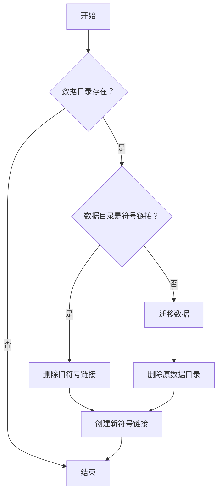

<div align="center">


# 软件狗狗 Scoop Dooge

[](https://github.com/xrgzs/sdoog/actions/workflows/ci.yml)
[](https://github.com/xrgzs/sdoog/blob/master/LICENSE)
[](https://www.microsoft.com/en-us/windows)
[](https://github.com/xrgzs/sdoog)
[](https://github.com/xrgzs/sdoog/tree/master/bucket)

对现有仓库的补充，采用激进的持久化策略，持续建设中

</div>

## 使用说明

### 添加本仓库

```powershell
scoop bucket add sdoog https://github.com/xrgzs/sdoog.git
```

或者

```powershell
scoop bucket add sdoog https://gh.xrgzs.top/https://github.com/xrgzs/sdoog.git
```

### 还没安装 Scoop？

配套 Scoop 特供优化版（[仓库](https://github.com/xrgzs/scoop)），优化包括但不限于：

1. 添加 hook，自动判断并替换下载链接为国内源，无需仓库支持；基于 ISP 检测，加速策略更为精准
2. 执行 `scoop search` 时避免大量报错
3. 执行 `scoop update` 时不使用 `git pull` 拉取仓库，无需手动解决 commit 冲突
4. 安装脚本自动配置好 7zip、git、aria2 环境，并做好相关优化
5. 安装脚本支持管理员权限安装，自动修复 Scoop 文件 ACL 到当前用户

#### 默认安装

```powershell
irm c.xrgzs.top/c/scoop | iex
```

#### 增加指定软件

多个可用空格分隔

```powershell
iex "& { $(irm c.xrgzs.top/c/scoop) } -Append xrok"
```

#### 精简安装

仅安装主程序、git、aria2，添加 main 和 sdoog

```powershell
iex "& { $(irm c.xrgzs.top/c/scoop) } -Slim"
```

#### 设置安装路径

安装到 D 盘

```powershell
iex "& { $(irm c.xrgzs.top/c/scoop) } -ScoopDir 'D:\Scoop' -ScoopGlobalDir 'D:\ScoopGlobal'"
```

#### 切换到此版本

如果已经安装 Scoop，可以切换到此专用版本

```powershell
# scoop config scoop_repo "https://gh.xrgzs.top/https://gitee.com/xrgzs/scoop"
scoop config scoop_repo 'https://gitee.com/xrgzs/scoop'

scoop update
```

### 安装软件

使用 `scoop` 命令行，或者安装 [UniGetUI](https://github.com/marticliment/UniGetUI) 来管理软件

#### 搜索软件

内置命令搜索（速度慢）：

```powershell
scoop search chrome
```

外置命令搜索（速度快，需要安装 `scoop-search`）：

```powershell
scoop-search chrome
```

#### 查看软件的配置清单

```powershell
scoop cat sdoog/chrome
```

建议在安装某个软件前都看一下（如果看得懂的话），或者[设置安装前显示清单](#设置安装前显示清单)

#### 为当前用户安装

安装路径：`~\scoop\apps`

```powershell
scoop install chrome
```

指定仓库安装：

```powershell
scoop install sdoog/chrome
```

#### 为所有用户安装

安装路径：`C:\ProgramData\scoop`

```powershell
scoop install harmonyos-sans -g
```

### 卸载软件

卸载但保留数据：

```powershell
scoop uninstall chrome
```

卸载且不保留数据（彻底卸载）：

```powershell
scoop uninstall -p chrome
```

卸载全局安装的软件：

```powershell
scoop uninstall harmonyos-sans -g
```

### 升级软件

#### 升级 Scoop 本身和所有 bucket 但不更新 app

```powershell
scoop update
```

类似 `apt update`

#### 查看可更新 app

```powershell
scoop status

# Output:
#
# Name Installed Version Latest Version Missing Dependencies Info
# ---- ----------------- -------------- -------------------- ----
# xrpe 24.11.8.513       24.11.19.47
```

类似 `apt list --upgradeable`

#### 升级单个 app

```powershell
scoop update xrpe
```

#### 更新 Scoop、bucket、app

```powershell
scoop update *
```

#### 更新全局 app

```powershell
scoop update <app> -g
```

#### 禁止更新某个软件包

```powershell
scoop hold <app>
```

取消：

```powershell
scoop unhold <app>
```

### 其他操作

#### 查看已安装 app

```powershell
scoop list
```

#### 重设软件

如已经安装 `python310` 和 `python38`，可以使用 `scoop reset` 切换版本

```powershell
scoop reset python310
scoop reset python38
```

注意并非重装，不会执行安装脚本，如果需要重装的话请卸载后再安装，或者强制升级

#### 导出配置

以 JSON 格式导出已安装的应用、软件库（以及可选的配置）

可以实现对已安装软件列表的备份

```powershell
scoop export > scoopfile.json
```

#### 导入配置

以 JSON 格式导入应用程序、软件库和配置

可以制作软件安装“捆绑包”

```powershell
scoop import .\scoopfile.json
```

#### 暂存软件安装包到缓存文件夹

```powershell
scoop download harmonyos-sans
```

#### 清理缓存文件夹

```powershell
scoop cache rm *
```

#### 清理旧版本软件

```powershell
scoop cleanup *
```

#### 检查存在的问题

```powershell
scoop checkup
```

### 更改配置

此处仅列出常用操作，更多请通过 `scoop help config` 查看

#### 设置代理

```powershell
scoop config proxy 127.0.0.1:10809
```

除了Scoop，您可能还要给 git 设置代理：

```powershell
git config --global http.proxy http://127.0.0.1:10809
git config --global https.proxy http://127.0.0.1:10809
```

取消：

```powershell
scoop config rm proxy

git config --global --unset http.proxy
git config --global --unset https.proxy
```

#### 设置安装前显示清单

显示将要安装的每个应用程序的配置清单，然后询问用户是否要继续

```powershell
scoop config show_manifest $true
```

#### 取消正在运行进程检测

当设置为 `$false`（默认）时，如果 Scoop 检测到任何目标应用程序进程正在运行，它将立即停止重置/卸载/更新

设置为 `$true` 时，Scoop 仅显示警告消息并继续重置/卸载/更新

```powershell
scoop config ignore_running_processes $true
```

#### Aria2c调优

需要先安装 aria2c 才能生效

以下是我们安装脚本的默认配置项：

```powershell
# 禁用证书有效性检测（不安全）
scoop config aria2-options '--check-certificate=false'
# 设置最大16线程
scoop config aria2-max-connection-per-server 16
scoop config aria2-split 16
# 设置最小分割大小
scoop config aria2-min-split-size 1M
# 启用 Aria2c
scoop config aria2-enabled true
# 关闭 Scoop 的 Aria2c 警告
scoop config aria2-warning-enabled false
```

注意：

- 如果要使用 16 以上的线程，需要更换非官方编译的版本

- 设置过大的线程数可能会导致服务器检测为CC攻击导致封禁，如果遇到问题可尝试减少线程数

## 使用技巧

### 创建桌面快捷方式

安装任意桌面整理软件，映射开始菜单下的 `Scoop Apps` 文件夹即可，兼容所有仓库

开始菜单路径：`%AppData%\Microsoft\Windows\Start Menu\Programs\Scoop Apps`

个人使用 DeskGo，téng xùn 为数不多的良心产品，[点此下载](http://api.xrgzs.top/qqsoft/?softid=23125)

### 你是否需要使用 Scoop 来安装某个应用

#### 持久化

Scoop 最能吸引本人的一个特点就是能够通过软链接（Junction）来持久化程序配置，这点是其他包管理器（WinGet、Chocolatey等）做不到的

持久化程序配置的好处有很多，对于用户来说，您可以将 Scoop 安装到 D 盘，这样你在重装 / 重置系统后无需重新配置已经安装的程序，方便折腾系统

不过很多仓库都没有针对这个特性做优化。因此我们特此开了 Sdoog 仓库来解决这个问题

不过，有些内容是无法被持久化的，比如注册表、机器码、系统码等，此时您需要做出考虑

#### 环境化

Scoop 的一个特点是能够自动配置好开发环境，能够自动配置好环境变量（PATH）、添加 shims

不过，有些时候受软件清单编写者、部分没有使用过外置包管理/写绝对路径的程序员的限制，使用 Scoop 安装的开发组件相当于更改了默认安装目录，无法被部分软件正确识别，此时您需要做出考虑

#### 绿色化

对于没有安装程序的开源小工具、绿色软件来说，Scoop 就是他们的安装程序，您无需折腾各种环境配置项，软件清单编写者会为您全部搞定，有效降低使用门槛（但不是没有门槛）

如果软件没有提供绿色版压缩包，Scoop 还能自动将官方版本的软件自动解包，而非像 WinGet 那样执行官方的安装程序安装，这样可以避免官方安装程序的一些流氓行为

不过，有些软件需要执行文件关联、服务安装，受限于软件清单编写者，可能无法实现（涉及到大量注册表等项目的抓取，相当于重写安装程序，这是一个大工程，需要具有软件绿化的相关经验）

另外，一些软件的安装程序中包括很多配置项，使用静默安装的软件包管理器均无法让您手动选择

#### 自动化

Scoop 能够利用 Github Actions 自动定期爬取软件的最新版本，无需您手动前往官方网站查看

Scoop 能够跳过安装程序直接解压程序进行安装，相当于实现了静默安装

对于部分无法解压的应用，只要提供了静默安装参数，Scoop都能自动安装

Scoop 能够自动校验安装程序的哈希值，确保和配置文件的一致

部分软件可能频繁调整接口导致无法获取最新更新，或者更换安装包但不更新版本，此时可能会出现问题

不过，出现这种情况您可以直接提 Issue 或修好后直接 Pull Request 给仓库

#### 小众化

在 Windows 系统上安装软件有很多解决方案，通过软件官网下载安装包安装、使用软件管家/MS Store安装是最常见的安装方式

Scoop 由于不是 GUI 程序，不提供界面，大量以英文为输出，看不懂直接放弃（即使有 UniGetUI，会用的没几个，经过调研，大部分人会嫌它天天提示更新）

Scoop 依赖于 GitHub 等需要科学的基础设施，能看到这句话说明你已经不简单了

同时 WinGet 通过内置于 Windows ISO 的方式预装在每一台个人电脑上，无需刻意安装

相比 WinGet、Chocolatey，Scoop 安装软件的方式可能比较奇葩，基本不会受到开发者的官方支持

所以，类似于 Arch Linux 的 AUR，Scoop 是一个比较小众化的社区，小众中的小众，出现问题可能需要您自行解决

#### 安全性

Scoop 的代码均开源在 GitHub，且为 PowerShell 脚本，没有混淆，您可以随意查看

Scoop bucket 的软件安装包配置为 JSON 格式，安装需要调用的命令公开，您可以随意查看

但我们无法保证代码开源就一定安全，包括 AUR 也出现过被改入恶意代码的事件，此外还有各种供应链攻击，且收集的大多软件并非开源，部分正规的大型软件都存在恶意行为，，这是无法避免的问题，换回寻呼机都没用，您需要自行做好使用信息技术的风险评估，对环境进行隔离、安装一款准确、带有行为检测的安全软件

## 提交贡献

以下是几点提交贡献的小提示：

1. 不要重复添加以下仓库已有的配置清单，除非配置清单内容不同或有特殊优化：

    此仓库为潇然系统优化版 scoop（可通过上面的命令安装）打造，默认安装会添加以下仓库：

    | Name            | Source                                             |
    | --------------- | -------------------------------------------------- |
    | main            | <https://github.com/ScoopInstaller/Main>             |
    | extras          | <https://github.com/ScoopInstaller/Extras>           |
    | versions        | <https://github.com/ScoopInstaller/Versions>         |
    | nirsoft         | <https://github.com/ScoopInstaller/Nirsoft>          |
    | sysinternals    | <https://github.com/niheaven/scoop-sysinternals>     |
    | php             | <https://github.com/ScoopInstaller/PHP>              |
    | nerd-fonts      | <https://github.com/matthewjberger/scoop-nerd-fonts> |
    | nonportable     | <https://github.com/ScoopInstaller/Nonportable>      |
    | java            | <https://github.com/ScoopInstaller/Java>             |
    | games           | <https://github.com/Calinou/scoop-games>             |
    | **dorado**      | <https://github.com/chawyehsu/dorado.git>            |

2. 无需担心 GitHub 无法下载问题，优化版 Scoop 自带的 `Url Proxy` 功能能够自动处理

3. 尽量使用便携版软件，并 `persist` 程序数据，尽量纳入 scoop 原生管理

4. 不要使用绝对路径，请使用 scoop 提供的变量或 `$env:系统变量`

5. 安装时创建的文件，卸载的时候要删除

6. 如果有自动更新程序，最好干掉，如果是后台自动更新无法关闭那种，不要安装到 `scoop\apps` 目录下

7. 如果能加入优化配置文件，如禁止更新、关闭广告等，那么请尽量加入（别人不做的我们做）

8. 受限于 scoop 的机制，不适合用 scoop 安装的软件，可以 ~~祸害~~ 提交到其它仓库（甩锅+手动狗头.jpg）

9. 遵循 [Scoop Contributing Guide](https://github.com/ScoopInstaller/.github/blob/main/.github/CONTRIBUTING.md#for-scoop-buckets) 的规范提交 Pull Request，懒得看的话，需要注意以下几点：

    - 不要用 Master 分支提交 Pull Request
    - 一个 Manifest 一个 Branch 一个 Pull Request
    - 本仓库对 Pull Request、Commit 和 Branch 命名没有强制性要求，但要能看得出来改了什么

10. 提交 PR 前，请开一台电脑或虚拟机，要求**开启 UAC**，测试以下内容：

    - 能够正常安装

        ```powershell
        scoop install .\bucket\<name>.json
        ```

    - 能够正常使用

    - 能够正常持久化配置文件

    - 能够正常卸载

    - 能够正常执行 Autoupdate，两种测试方法：

        1. VS Code “运行和调试” 中测试（按 F5）

        2. 在项目根目录执行：

            ```powershell
                .\bin\checkver.ps1 -App 软件名称 -ForceUpdate
            ```

11. 提交 PR 时，清空默认的提交内容，加入你认为有用的信息（提交上一步测试的截图/输出）

12. 提交 PR 后，如果有更改，在 GitHub PR 页面发送评论 `/verify`，让机器人再次检测

希望此规范能够帮助到参与第三方 scoop 仓库的贡献者，提供一个轻松、高效的软件提交流程，如果不会搞的话可以发 issue。

## 编写技巧

本仓库一些关于编写配置的规范和技巧（不看会后悔）

### 配置定义

你想知道关于配置清单的定义项，这里都有，在编写配置清单时建议同时打开：

- [App Manifests](https://github.com/ScoopInstaller/Scoop/wiki/App-Manifests)
  - [Creating an App Manifest](https://github.com/ScoopInstaller/Scoop/wiki/Creating-an-app-manifest)
  - [Autoupdate](https://github.com/ScoopInstaller/Scoop/wiki/App-Manifest-Autoupdate)
  - [Persistent data](https://github.com/ScoopInstaller/Scoop/wiki/Persistent-data)
  - [Pre and Post install and uninstall Scripts](<https://github.com/ScoopInstaller/Scoop/wiki/Pre-Post-(un)install-scripts>)

### 读取脚本

读取现有配置中的脚本块，避免人脑反转义

从配置清单中读取：

```powershell
PS D:\sdoog> (Get-Content .\bucket\qqnt.json | ConvertFrom-Json).installer.script

# Output:
$configpath = "$env:PUBLIC\Documents\Tencent\QQ"
if (!(Test-Path -Path "$configpath")) {
    New-Item -Path "$configpath" -Type Directory -Force -ErrorAction SilentlyContinue | Out-Null
}
if (!(Test-Path -Path "$configpath\UserDataInfo.ini" -PathType leaf)) {
    Set-Content -NoNewline -Path "$configpath\UserDataInfo.ini" -Value "[UserDataSet]`nUserDataSavePathType=2`nUserDataSavePath=`"$persist_dir\Tencent Files`""
}
```

从 `scoop cat` 中读取：

```powershell
PS D:\sdoog> (scoop cat python | ConvertFrom-Json).installer.script

# Output:
Expand-DarkArchive "$dir\setup.exe" "$dir\_tmp"
@('path.msi', 'pip.msi') | ForEach-Object {
    Remove-Item "$dir\_tmp\AttachedContainer\$_"
}
(Get-ChildItem "$dir\_tmp\AttachedContainer\*.msi").FullName | ForEach-Object {
    # appendpath.msi does not contain any file, which causes 'msiexec /a' to fail
    if($((Get-Item $_).Basename) -eq 'appendpath') { return }
    Expand-MsiArchive $_ "$dir"
}
Remove-Item "$dir\_tmp", "$dir\setup.exe" -Force -Recurse
if ($global) {
    $pathext = (Get-EnvVar -Name PATHEXT -Global) -replace ';.PYW?', ''
    Set-EnvVar -Name PATHEXT -Value "$pathext;.PY;.PYW" -Global
}
```

### 嵌入脚本

还在吐槽爬虫难写、人工转义费劲？

将 PowerShell 脚本块转换成 JSON Array 以便嵌入到配置中，自动转义相关符号，避免人工转义

所以你可以放心往脚本里面多写点东西，使此仓库具有独特性

```powershell
PS D:\sdoog> Get-Content .\Untitled-1.ps1

# Output:
if ($global) {
    $pathext = (Get-EnvVar -Name PATHEXT -Global) -replace ';.PYW?', ''
    Set-EnvVar -Name PATHEXT -Value "$pathext;.PY;.PYW" -Global
}

PS D:\sdoog> Get-Content .\Untitled-1.ps1 | ConvertTo-Json

# Output:
[
  "if ($global) {",
  "    $pathext = (Get-EnvVar -Name PATHEXT -Global) -replace ';.PYW?', ''",
  "    Set-EnvVar -Name PATHEXT -Value \"$pathext;.PY;.PYW\" -Global",
  "}"
]
```

### 蓝奏文件夹分享自动更新

参考 [pecmd-beta](bucket/pecmd-beta.json)

### WinGet 自动更新

我们提供了 WinGet PowerShell 模块，只需导入即可使用

manifestUrl 会在 DEBUG 中输出，建议开启 DUBUG，以便查看具体 YAML 配置

如果只要版本号，可以：

```json
"checkver": {
    "script": [
        "Import-Module \"$pwd\\bin\\WinGet.psm1\"",
        "$Manifest = Get-WinGetInfo -Id '<WinGetPackageID>'",
        "$Manifest.latest_version"
    ]
},
"autoupdate": {
    "url": "https://www.example.com/download/$version/$version"
}
```

如果要同时将版本号和 URL 同时匹配出来，可以：

```json
"checkver": {
    "script": [
        "Import-Module \"$pwd\\bin\\WinGet.psm1\"",
        "$Manifest = Get-WinGetManifest -Id '<WinGetPackageID>'",
        "$version  = $Manifest.PackageVersion",
        "$url      = $Manifest.Installers.InstallerUrl",
        "return \"$version=====$url\""
    ],
    "regex": "(.*)=====(?<url>.*)"
},
"autoupdate": {
    "url": "$matchUrl"
}
```

### 获取转链内容

`Get-RedirectedUrl1st`：获取 301 / 302 等转链第一次跳转的内容（Location 头）

### 持久化数据

官方文档仅适用于便携版软件（数据存程序同一目录），比较简单，这边需要进一步补充

<https://github.com/ScoopInstaller/Scoop/wiki/Persistent-data>

如果要持久化的数据非文件夹，如配置文件，需要在 `pre_install` 中创建对应需要持久化的文件，像这样：

```json
"persist":[
    "Settings.json"
],
"pre_install":[
    "if (!(Test-Path \"$dir\\Settings.json\") -or !(Get-Item \"$dir\\Settings.json\").Length) {",
    "    New-Item \"$dir\\Settings.json\" -ItemType File -Force -ErrorAction SilentlyContinue | Out-Null",
    "    Set-Content -Path \"$dir\\Settings.json\" -Value '{\"UpdateMode\":0}'",
    "}"
]
```

如果要持久化的数据与程序不在同一目录，如 `$env:APPDATA` / `$env:LOCALAPPDATA` 等，这种情况 scoop 不支持处理，我们需要设定一个标准手动解决

笔记：

> 正常 `persist` 定义的持久化数据在执行 `scoop uninstall <name>` 时不会删除，需要使用 `scoop uninstall <name> -p` 命令
>
> 目前 `scoop uninstall <name> -p` 可以删除手动创建的持久化数据
>
> 某仓库会在 `uninstall` 字段删除持久化数据，这边我们遵循 scoop 的设计规范，不学那样搞，因为 scoop 没有 `reinstall` 命令，你只能卸了重装
>
> PowerShell 的 `Remove-Item` cmdlet 无法删除 junction，需要使用 .NET [`System.IO.Directory` 的 `Delete` 方法](https://learn.microsoft.com/zh-cn/dotnet/api/system.io.directory.delete)

在 `installer.script` 中添加迁移配置和创建 Junction 的代码

```powershell
. "$bucketsdir\$bucket\bin\utils.ps1"
New-PersistDirectory "$env:APPDATA\Seewo\EasiNote5" "$persist_dir\Data" -Migrate
```



在 `uninstaller.script` 中添加删除 Junction 的代码，不处理 `$persist_dir`

```powershell
$bucket = $install.bucket
. "$bucketsdir\$bucket\bin\utils.ps1"
Remove-Junction "$env:APPDATA\Seewo\EasiNote5"
```

参考 [easinote](bucket/easinote.json)

这些命令需要外置脚本，所有请务必在仓库内测试

### 关闭目录下的所有程序

`Stop-App`：关闭安装目录下所有正在运行的程序，可加第一个参数传入需要关闭的其它目录，使用此函数无需指定程序名称

建议在 `pre_uninstall`、`uninstaller.script` （无法避免 scoop 检测正在运行）中调用

```powershell
$bucket = $install.bucket
. "$bucketsdir\$bucket\bin\utils.ps1"
Stop-App
```

目前暂不支持提权关闭

### 安装 UWP 应用

开启开发者模式，然后使用 `Add-AppxPackage -Register <AppxManifestPath>` 即可

无需担心 MS Store 会自动升级

可能不支持 persist，需要自行测试

参考 [snap.hutao](bucket/snap.hutao.json)

### 导入注册表

本人习惯优先使用 `reg.exe add` 设置注册表，但有些参数不方便传入，此时可先生成并输出 .reg 文件，然后再 `reg.exe import`导入

如果需要提权导入，可使用外置函数 `Set-RegValue`，会先检查是否已经为目标值，如果已有就不会提权导入

```powershell
$bucket = $install.bucket
. "$bucketsdir\$bucket\bin\utils.ps1"
Set-RegValue -Path "HKLM:\SOFTWARE\Microsoft\Windows\CurrentVersion\AppModelUnlock" -Name "AllowAllTrustedApps" -Value 1 -Type REG_DWORD
Set-RegValue -Path "HKLM:\SOFTWARE\Microsoft\Windows\CurrentVersion\AppModelUnlock" -Name "AllowDevelopmentWithoutDevLicense" -Value 1 -Type REG_DWORD
```

### 提权执行

在开启UAC的系统上，部分软件需要提权（使用管理员权限）才能安装，目前有几种解决方式：

1. 使用 sudo，有多个 sudo，我个人不喜欢使用这种方式

   - [lukesampson/psutils/sudo.ps1](https://github.com/lukesampson/psutils)（Scoop 官方使用）

   - `gsudo` 的别名

   - Windows 11 24H2+ 自带的 sudo（需要额外设置）

2. 使用 gsudo，在 `depends` 增加 gsudo，所有命令前面都要加上 gsudo

   - 可能不支持 PowerShell 命令（需要导入模块）

   - 优点是只需提权一次后续无需询问

3. 使用 Scoop 内置函数 `Invoke-ExternalCommand` （~\scoop\apps\scoop\current\lib\core.ps1）

    ```powershell
    Invoke-ExternalCommand "$dir\installer.exe" -ArgumentList @('/S', "/D=$dir") -RunAs -Quiet
    ```

    ```powershell
    Invoke-ExternalCommand "reg.exe" -ArgumentList @(
        'delete',
        'HKLM\Software\Microsoft\Windows\CurrentVersion\Uninstall\Weasel',
        '/f',
        '/v', 'UninstallString',
        '/reg:32'
    ) -RunAs -Activity 'Removing previous installation registry key...' -ContinueExitCodes @{1='Not installed'} | Out-Null
    ```

4. 使用 PowerShell 自带 `Start-Process`

   ```powershell
   Start-Process -FilePath "$dir\installer.exe" -ArgumentList @('/S', "/D=$dir") -Wait -Verb "RunAs" -WindowStyle Hidden
   ```

5. 不允许以用户权限安装，如果你安装的软件大量涉及到 HKLM、提权，此时为了避免麻烦，推荐使用这种方式，否则尽量使用上述几种

    ```powershell
    if (!(is_admin)) {
        error "Administrator rights are required to install $app."
        scoop uninstall $app
        exit 1
    }
    ```

PS：UAC弹窗会超时

## 免责声明

访问本仓库或传播、查看、使用本仓库资源即视为同意且遵守本仓库的免责声明。

本仓库仅提供软件下载链接，并不提供任何软件及安装包。相关软件搜集自互联网，用户在使用前请自行评估风险，后果自担，我们不承担任何责任。

本仓库为非盈利性开源仓库，所有资源都来自互联网，所发布的一切资源及软件分析文章教程仅限用于学习、交流和研究目的，所有资源不代表本站立场。

本仓库并不贩卖软件，且不修改软件，不存在任何商业目的及用途，如果您访问和下载此仓库内的软件，表示您同意只将此文件或者技术教程用于参考、学习而非其他用途，请使用者和传播者遵循相关法律法规。

本仓库所有资源不得用于任何商业用途和非法用途。版权归原公司所有！如果您希望长期使用，请向作者购买正版版权，假如因用户未购买正版版权而导致版权纠纷，本站概不负责。如果无意侵犯了您的版权，请联系我们及时标明版权或是删除（提供相关版权证明）。

本仓库对任何资源不提供任何技术支持，遇到问题请自行研究或购买正版。

本仓库仅提供一个展示、交流的平台，不对其内容的准确性、真实性、正当性、合法性负责，也不承担任何法律责任。

任何人因使用本仓库而可能遭致的意外及其造成的损失（包括通过使用本站的资源而感染电脑病毒或查看本站技术文章并操作造成的经济损失），我们对此概不负责，亦不承担任何法律责任。

本仓库对发布的资源不能完全保证其完整性和安全性，请在下载后自行检查。在使用过程中出现的任何问题均与本仓库无关，请自行处理！部分资源有时效性，不保证发布的资源在任何时间绝对可用。

本仓库遵守国家法律法规，禁止制作、复制、发布、传播等具有反动、色情、暴力、淫秽，政治等内容的信息，一经发现，立即删除。

本仓库的传播者、使用者的一切意向、言行、用途和由此造成的任何结果，由该传播者和使用者自行负责，我们对此不承担任何法律责任。

本仓库在法律允许最大范围内对本声明拥有解释权与修改权。

如果本仓库有敏感资源或不合适的内容将积极配合有关执法部门检查及整改。

对免责声明的解释、修改及更新权均属于 @xrgzs 所有。
