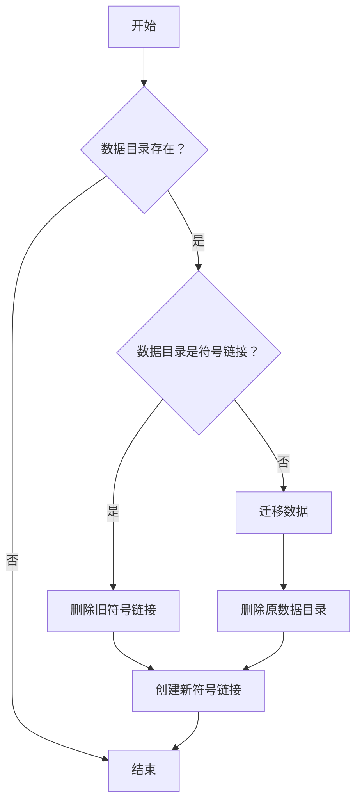

<div align="center">


# 软件狗狗 Scoop Dooge

[](https://github.com/xrgzs/sdoog/actions/workflows/ci.yml)
[](https://github.com/xrgzs/sdoog/blob/master/LICENSE)
[](https://www.microsoft.com/en-us/windows)
[](https://github.com/WuwuZiQWQ/March7th)

对现有仓库的补充，不求数量，只图好用

</div>


## 使用说明

### 添加本仓库：

```powershell
scoop bucket add sdoog https://github.com/xrgzs/sdoog.git
```

或者

```powershell
scoop bucket add sdoog https://gh.xrgzs.top/https://github.com/xrgzs/sdoog.git
```

### 还没安装 Scoop？

配套 scoop 特供优化版（[仓库](https://github.com/xrgzs/scoop)）：

```powershell
irm c.xrgzs.top/c/scoop | iex
```


## 提交贡献

以下是几点提交贡献的小提示：

1. 不要重复添加以下仓库已有的配置文件，除非配置文件内容不同或有特殊优化：

   此仓库为潇然系统优化版 scoop（可通过上面的命令安装）打造，默认安装会添加以下仓库：

   | Name            | Source                                             |
   | --------------- | -------------------------------------------------- |
   | main            | https://github.com/ScoopInstaller/Main             |
   | extras          | https://github.com/ScoopInstaller/Extras           |
   | versions        | https://github.com/ScoopInstaller/Versions         |
   | nirsoft         | https://github.com/ScoopInstaller/Nirsoft          |
   | sysinternals    | https://github.com/niheaven/scoop-sysinternals     |
   | php             | https://github.com/ScoopInstaller/PHP              |
   | nerd-fonts      | https://github.com/matthewjberger/scoop-nerd-fonts |
   | nonportable     | https://github.com/ScoopInstaller/Nonportable      |
   | java            | https://github.com/ScoopInstaller/Java             |
   | games           | https://github.com/Calinou/scoop-games             |
   | **abgo_bucket** | https://github.com/abgox/abgo_bucket.git           |
   | **aki**         | https://github.com/akirco/aki-apps.git             |
   | **dorado**      | https://github.com/chawyehsu/dorado.git            |
   | **DoveBoy**     | https://github.com/DoveBoy/Apps.git                |
   | **scoop-zapps** | https://github.com/kkzzhizhou/scoop-zapps.git      |

2. 无需担心 GitHub 无法下载问题，优化版 Scoop 自带的 `Url Proxy` 功能能够自动处理

3. 尽量使用便携版软件，并 `persist` 程序数据，尽量纳入 scoop 原生管理

4. 不要使用绝对路径，请使用 scoop 提供的变量或 `$env:系统变量`

5. 安装时创建的文件，卸载的时候要删除

6. 如果有自动更新程序，最好干掉，如果是后台自动更新无法关闭那种，不要安装到 `scoop\apps` 目录下

7. 如果能加入优化配置文件，尽量加入，别人不做的我们做

8. 受限于 scoop 的机制，不适合用 scoop 安装的软件，可以 ~~祸害~~ 提交到其它仓库（甩锅+手动狗头.jpg）

9. 遵循 [Scoop Contributing Guide](https://github.com/ScoopInstaller/.github/blob/main/.github/CONTRIBUTING.md#for-scoop-buckets) 的规范提交 Pull Request，懒得看的话，需要注意以下几点：

   - 不要用 Master 分支提交 Pull Request
   - 一个 Manifest 一个 Branch 一个 Pull Request
   - 本仓库对 Pull Request、Commit 和 Branch 命名没有强制性要求，但要能看得出来改了什么

10. 提交 PR 前，请开一台电脑或虚拟机，测试以下内容：

    - 能够正常安装

        ```powershell
        scoop install .\bucket\<name>.json
        ```

    - 能够正常使用

    - 能够正常执行 Autoupdate

        - 可以先破坏要更新的内容（尤其是 `version` 字段），然后本地执行检测操作，确保配置文件能用且为最新版本

        - 两种测试方法：

            1. VS Code 在 JSON 配置文件下按 <kbd>F5</kbd>

               - Only sdoog can do.

            2. 在项目根目录执行：

               ```powershell
                .\bin\checkver.ps1 -App 软件名称 -Update
               ```

11. 提交 PR 时，清空默认的提交内容，加入你认为有用的信息（提交上一步测试的截图/输出）

12. 提交 PR 后，如果有更改，在 GitHub PR 页面发送评论 `/verify`，让机器人再次检测

希望此规范能够帮助到参与第三方 scoop 仓库的贡献者，提供一个轻松、高效的贡献流程。

## 编写技巧

本仓库一些关于编写配置的规范和技巧（不看会后悔）

### 配置定义

你想知道关于配置文件的定义项，这里都有，在编写配置文件时建议同时打开：

https://github.com/ScoopInstaller/Scoop/wiki/App-Manifests

### 自动更新

`checkver` 不会写？看这里：

https://github.com/ScoopInstaller/Scoop/wiki/App-Manifest-Autoupdate

### 读取脚本

读取现有配置中的脚本块，避免人脑反转义

从配置文件中读取：

```powershell
PS D:\sdoog> (Get-Content .\bucket\qqnt.json | ConvertFrom-Json).installer.script

# Output:
$configpath = "$env:PUBLIC\Documents\Tencent\QQ"
if (!(Test-Path -Path "$configpath")) {
    New-Item -Path "$configpath" -Type Directory -Force -ErrorAction SilentlyContinue | Out-Null
}
if (!(Test-Path -Path "$configpath\UserDataInfo.ini" -PathType leaf)) {
    Set-Content -NoNewline -Path "$configpath\UserDataInfo.ini" -Value "[UserDataSet]`nUserDataSavePathType=2`nUserDataSavePath=`"$persist_dir\Tencent Files`""
}
```

从 `scoop cat` 中读取：

```powershell
PS D:\sdoog> (scoop cat python | ConvertFrom-Json).installer.script

# Output:
Expand-DarkArchive "$dir\setup.exe" "$dir\_tmp"
@('path.msi', 'pip.msi') | ForEach-Object {
    Remove-Item "$dir\_tmp\AttachedContainer\$_"
}
(Get-ChildItem "$dir\_tmp\AttachedContainer\*.msi").FullName | ForEach-Object {
    # appendpath.msi does not contain any file, which causes 'msiexec /a' to fail
    if($((Get-Item $_).Basename) -eq 'appendpath') { return }
    Expand-MsiArchive $_ "$dir"
}
Remove-Item "$dir\_tmp", "$dir\setup.exe" -Force -Recurse
if ($global) {
    $pathext = (Get-EnvVar -Name PATHEXT -Global) -replace ';.PYW?', ''
    Set-EnvVar -Name PATHEXT -Value "$pathext;.PY;.PYW" -Global
}
```

### 嵌入脚本

还在吐槽爬虫难写、人工转义费劲？

将 PowerShell 脚本块转换成 JSON Array 以便嵌入到配置中，自动转义相关符号，避免人工转义

所以你可以放心往脚本里面多写点东西，使此仓库具有独特性

```powershell
PS D:\sdoog> Get-Content .\Untitled-1.ps1

# Output:
if ($global) {
    $pathext = (Get-EnvVar -Name PATHEXT -Global) -replace ';.PYW?', ''
    Set-EnvVar -Name PATHEXT -Value "$pathext;.PY;.PYW" -Global
}

PS D:\sdoog> Get-Content .\Untitled-1.ps1 | ConvertTo-Json

# Output:
[
  "if ($global) {",
  "    $pathext = (Get-EnvVar -Name PATHEXT -Global) -replace ';.PYW?', ''",
  "    Set-EnvVar -Name PATHEXT -Value \"$pathext;.PY;.PYW\" -Global",
  "}"
]
```

### 蓝奏文件夹分享自动更新

参考 [pecmd-beta](bucket/pecmd-beta.json)


### WinGet 自动更新

我们提供了 WinGet PowerShell 模块，只需导入即可使用

manifestUrl 会在 DEBUG 中输出，建议开启 DUBUG，以便查看具体 YAML 配置

如果只要版本号，可以：

```json
"checkver": {
    "script": [
        "Import-Module \"$pwd\\bin\\WinGet.psm1\"",
        "$Manifest = Get-WinGetInfo -Id '<WinGetPackageID>'",
        "$ver = $Manifest.latest_version'",
        "return $ver\""
    ]
},
"autoupdate": {
    "url": "https://www.example.com/download/$version/$version"
}
```

如果要同时将版本号和URL同时匹配出来，可以：

```json
"checkver": {
    "script": [
        "Import-Module \"$pwd\\bin\\WinGet.psm1\"",
        "$Manifest = Get-WinGetManifest -Id '<WinGetPackageID>'",
        "$version  = $Manifest.PackageVersion",
        "$url      = $Manifest.Installers.InstallerUrl",
        "return \"$version=====$url\""
    ],
    "regex": "(.*)=====(?<url>.*)"
},
"autoupdate": {
    "url": "$matchUrl"
}
```


### 创建桌面快捷方式

啥？还要用外置脚本？直接从开始菜单复制一个不就行，卸载的时候记得删除

注意安装时机为 `post_install` ，`installer.script` 的时候还没创建开始菜单快捷方式

参考 [xrok](bucket/xrok.json)

### 持久化数据

官方文档仅适用于便携版软件（数据存程序同一目录），比较简单，这边需要进一步补充

https://github.com/ScoopInstaller/Scoop/wiki/Persistent-data

如果要持久化的数据非文件夹，如配置文件，需要在 `pre_install` 中创建对应需要持久化的文件，像这样：

```json
"persist":[
    "Settings.json"
],
"pre_install":[
    "if (!(Test-Path \"$dir\\Settings.json\") -or !(Get-Item \"$dir\\Settings.json\").Length) {",
    "    New-Item \"$dir\\Settings.json\" -ItemType File -Force -ErrorAction SilentlyContinue | Out-Null",
    "    Set-Content -Path \"$dir\\Settings.json\" -Value '{\"UpdateMode\":0}'",
    "}"
]
```

如果要持久化的数据与程序不在同一目录，如 `$env:APPDATA` / `$env:LOCALAPPDATA` 等，这种情况 scoop 不支持处理，我们需要设定一个标准手动解决

笔记：

> 正常 `persist` 定义的持久化数据在执行 `scoop uninstall <name>` 时不会删除，需要使用 `scoop uninstall <name> -p` 命令
>
> 目前 `scoop uninstall <name> -p` 可以删除手动创建的持久化数据
>
> 某仓库会在 `uninstall` 字段删除持久化数据，这边我们遵循 scoop 的设计规范，不学那样搞，因为 scoop 没有 `reinstall` 命令，你只能卸了重装
>
> PowerShell 的 `Remove-Item` cmdlet 无法删除 junction，需要使用 .NET [`System.IO.Directory` 的 `Delete` 方法](https://learn.microsoft.com/zh-cn/dotnet/api/system.io.directory.delete)

在 `installer.script` 中添加迁移配置和创建 Junction 的代码

```powershell
. "$bucketsdir\$bucket\bin\utils.ps1"
New-PersistDirectory "$env:APPDATA\Seewo\EasiNote5" "$persist_dir\Data" -Migrate
```



在 `uninstaller.script` 中添加删除 Junction 的代码，不处理 `$persist_dir`

```powershell
. "$bucketsdir\$bucket\bin\utils.ps1"
Remove-Junction "$env:APPDATA\Seewo\EasiNote5"
```

参考 [easinote](bucket/easinote.json)

我们目前认为这些命令不用外置脚本，方便在虚拟机里面不加仓库直接测试

*未完待续……*
